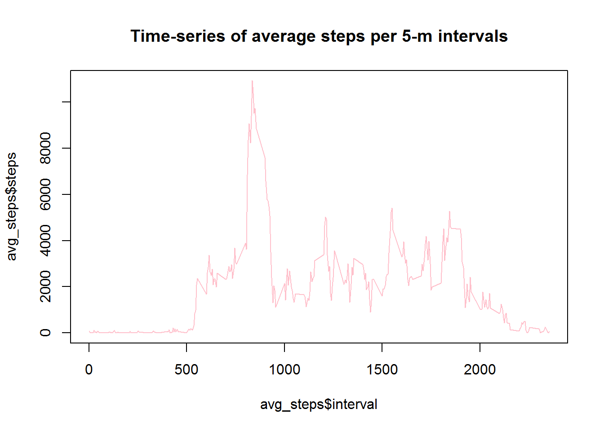

PA1_template
------------------------------------------------------------------
#1. Loading and preprocessing the data

Load the data
Convert data into calender date

```{r}
data <- read.csv("activity.csv")
data$date <- as.Date(data$date, format="%Y-%m-%d")
```


#2. What is mean total number of steps taken per day?


Sum steps per day
Plot histogram
Calculate mean of the total number of steps taken per day
CAREFUL, use 'sum_steps' instead of 'Sum_steps' because 'Sum_steps' was   converted by as.numeric function
Calculate median of the total number of steps taken per day

```{r}
sum_steps<-aggregate(x=data$steps, by=list(data$date),FUN=sum, na.rm=TRUE)
names(sum_steps) <- c("date","steps")
Sum_steps <- sapply(sum_steps, as.numeric)
hist(Sum_steps, main="Sum of steps per day", col="pink")
mean(sum_steps$steps)
median(sum_steps$steps)

```


mean: 9354.23
median:10395

#3. What is the average daily activity pattern?

avgerage steps time series plot
plot time series
interval that contains max number of steps

```{r}
avg_steps <- aggregate(x=data$steps, by=list(data$interval), FUN=sum, na.rm=TRUE)
names(avg_steps) <- c("interval","steps")
plot(avg_steps$interval, avg_steps$steps, type="l", col="pink", main="Time-series of average steps per 5-m intervals")
avg_steps[which.max(avg_steps$steps), c("interval")]

```




max interval: 835

#4. Imputing missing values

Ccalculate missing value numbers
For convenience the missing values are 0
Replace na with 0s
Sum steps per day with na
Plot histogram with na
Calculate mean of the total number of steps taken per day with na
CAREFUL, use 'sum_steps2' instead of 'Sum_steps2' because 'Sum_steps2'     was converted by as.numeric function
Calculate median of the total number of steps taken per day with na

```{r}
nrow(data[is.na(data$steps),])
na <- which(is.na(data$steps))
zero <- rep(0, times=length(na))
data[na, "steps"] <- zero
sum_steps2<-aggregate(x=data$steps, by=list(data$date),FUN=sum, na.rm=TRUE)
names(sum_steps2) <- c("date","steps")
Sum_steps2 <- sapply(sum_steps2, as.numeric)
hist(Sum_steps2, main="Sum of steps per day with na", col="pink")
mean(sum_steps2$steps)
median(sum_steps2$steps)

```


mean:9354.23
median:10395

Well... na=0 so mean and median didn't change. Cannot know the impact of imputing missing values.


#5. Are there differences in activity patterns between weekdays and weekends?

new factor variable spliting weekday and weekend
new factor variable of average weekday and average weekend
organize
plotting

```{r}
data.weekend <- subset(data, weekdays(date) %in% c("Saturday", "Sunday"))
data.weekday <- subset(data, !weekdays(date) %in% c("Saturday", "Sunday"))
data.weekend <- aggregate(data$steps ~ data$interval, data.weekend, mean)
data.weekday <- aggregate(data$steps ~ data$interval, data.weekday, mean)
data.weekend <- cbind(data.weekend, day = rep("weekend"))
data.weekday <- cbind(data.weekday, day = rep("weekday"))
data.week <- rbind(data.weekend, data.weekday)
levels(data.week$day) <- c("Weekend", "Weekday")
par(mfrow=c(2,1))
plot(data$steps~data$interval, type="l", main="weekend", col="lightblue")
plot(data$steps~data$interval, type="l", main="weekday", col="lightblue")
```


